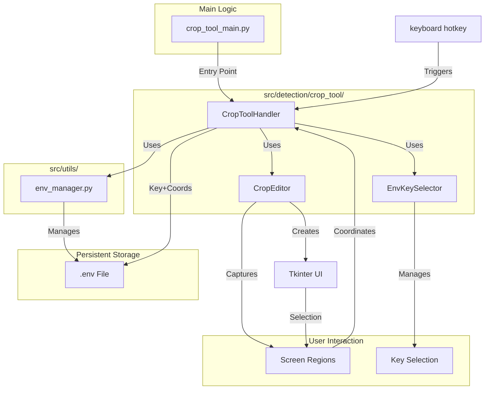

```mermaid
graph TD
    A[crop_tool_main.py] -->|Entry Point| B[CropToolHandler]
    B -->|Uses| C[CropEditor]
    B -->|Uses| D[EnvKeySelector]
    B -->|Uses| E[env_manager.py]
    
    C -->|Captures| F[Screen Regions]
    D -->|Manages| G[Key Selection]
    E -->|Manages| H[.env File]
    
    subgraph "Main Logic"
        A
    end
    
    subgraph "src/detection/crop_tool/"
        B
        C
        D
    end
    
    subgraph "src/utils/"
        E
    end
    
    subgraph "User Interaction"
        F
        G
    end
    
    subgraph "Persistent Storage"
        H
    end
    
    I[keyboard hotkey] -->|Triggers| B
    C -->|Creates| J[Tkinter UI]
    J -->|Selection| F
    F -->|Coordinates| B
    B -->|Key+Coords| H
```